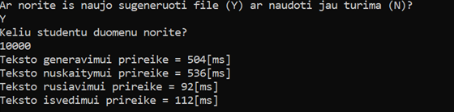

# Veikimas
[atgal į master](https://github.com/auteea/Obj_programavimas)
- Galima pasirinkti ar sukurti naują file, ar naudoti jau turimą.
- Programa sukuria duomenų failą su pasirinktu studentų skaičiumi.
- Studentai pagal galutinį pažymį išskirstomi į dvi grupes: "vargšiukai" < 5 ir "galvočiai" => 5
- Rezultatai išvedami į atskirus files
- Atliekama teksto sukūrimo, nuskaitymo, rūšiavimo bei išvedimo spartos analizė

# Išvedimo pavyzdys:

