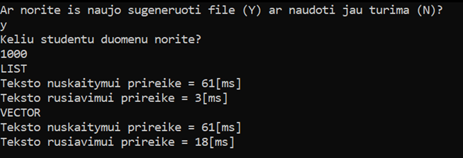
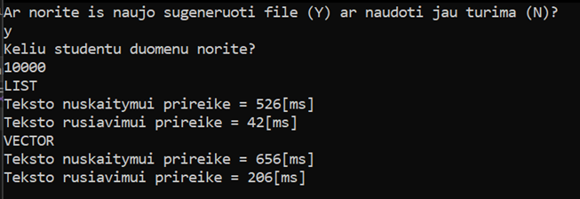
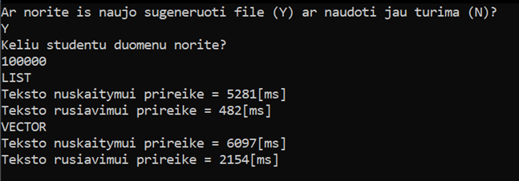
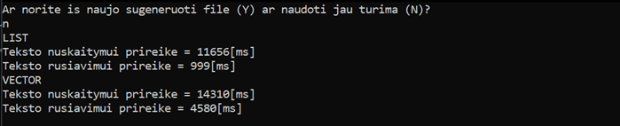

# v0.4
[atgal į master](https://github.com/auteea/Obj_programavimas/tree/main)

**Konteinerių testavimas**

Atliekamas vector ir list konteinerių spartos palyginimas nuskaitant/sukuriant duomenis ir juos surūšiuojant bei dalijant į dvi grupes.

**Kompiuterio parametrai**

-CPU: Intel(R) Core(TM) i5-10210U CPU @ 1.60GHz   2.11 GHz
-RAM: 8GB
-HDD: SSD 512 GB

**Rezultatai**
- Spartos analizė su 1000 duomenų:

- Spartos analizė su 10 000 duomenų:

- Spartos analizė su 100 000 duomenų:

- Spartos analizė su 1 000 000 duomenų:

